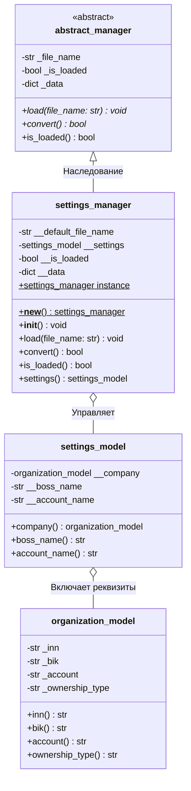
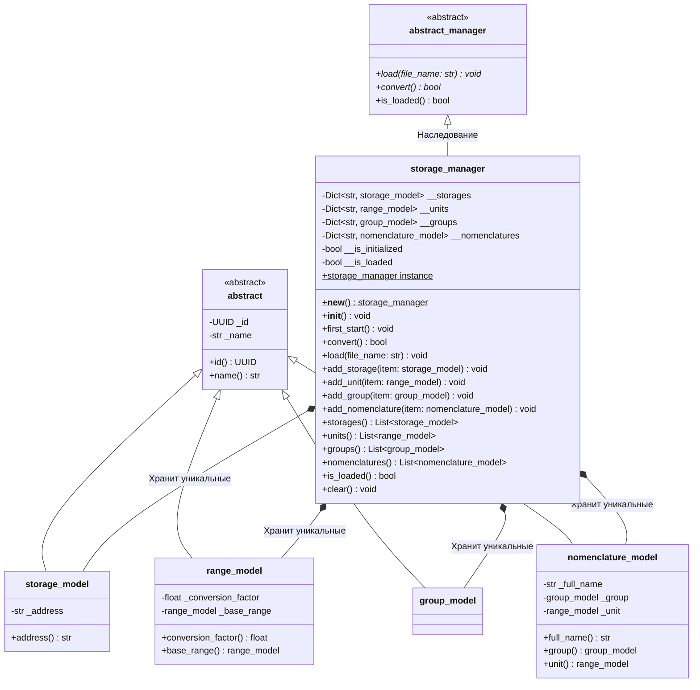

## 1. Диаграмма классов `settings_manager`

```mermaid
classDiagram
    direction TB

    class abstract_manager {
        <<abstract>>
        -str _file_name
        -bool _is_loaded
        -dict _data
        +load(file_name: str)* void
        +convert()* bool
        +is_loaded() bool
    }

    class settings_manager {
        -str __default_file_name
        -settings_model __settings
        -bool __is_loaded
        -dict __data
        +settings_manager instance$
        +__new__() settings_manager$
        +__init__() void
        +load(file_name: str) void
        +convert() bool
        +is_loaded() bool
        +settings() settings_model
    }

    class settings_model {
        -organization_model __company
        -str __boss_name
        -str __account_name
        +company() organization_model
        +boss_name() str
        +account_name() str
    }

    class organization_model {
        -str _inn
        -str _bik
        -str _account
        -str _ownership_type
        +inn() str
        +bik() str
        +account() str
        +ownership_type() str
    }

    abstract_manager <|-- settings_manager : Наследование
    settings_manager o-- settings_model : Управляет
    settings_model o-- organization_model : Включает реквизиты
```

---

## 2. Диаграмма классов `storage_manager`

```mermaid
classDiagram
    direction TB

    class abstract_manager {
        <<abstract>>
        +load(file_name: str)* void
        +convert()* bool
        +is_loaded() bool
    }

    class storage_manager {
        -Dict~str, storage_model~ __storages
        -Dict~str, range_model~ __units
        -Dict~str, group_model~ __groups
        -Dict~str, nomenclature_model~ __nomenclatures
        -bool __is_initialized
        -bool __is_loaded
        +storage_manager instance$
        +__new__() storage_manager$
        +__init__() void
        +first_start() void
        +convert() bool
        +load(file_name: str) void
        +add_storage(item: storage_model) void
        +add_unit(item: range_model) void
        +add_group(item: group_model) void
        +add_nomenclature(item: nomenclature_model) void
        +storages() List~storage_model~
        +units() List~range_model~
        +groups() List~group_model~
        +nomenclatures() List~nomenclature_model~
        +is_loaded() bool
        +clear() void
    }

    class abstract {
        <<abstract>>
        -UUID _id
        -str _name
        +id() UUID
        +name() str
    }

    class storage_model {
        -str _address
        +address() str
    }

    class range_model {
        -float _conversion_factor
        -range_model _base_range
        +conversion_factor() float
        +base_range() range_model
    }

    class group_model {
    }

    class nomenclature_model {
        -str _full_name
        -group_model _group
        -range_model _unit
        +full_name() str
        +group() group_model
        +unit() range_model
    }

    abstract_manager <|-- storage_manager : Наследование
    abstract <|-- storage_model
    abstract <|-- range_model
    abstract <|-- group_model
    abstract <|-- nomenclature_model

    storage_manager *-- storage_model : Хранит уникальные
    storage_manager *-- range_model : Хранит уникальные
    storage_manager *-- group_model : Хранит уникальные
    storage_manager *-- nomenclature_model : Хранит уникальные
```